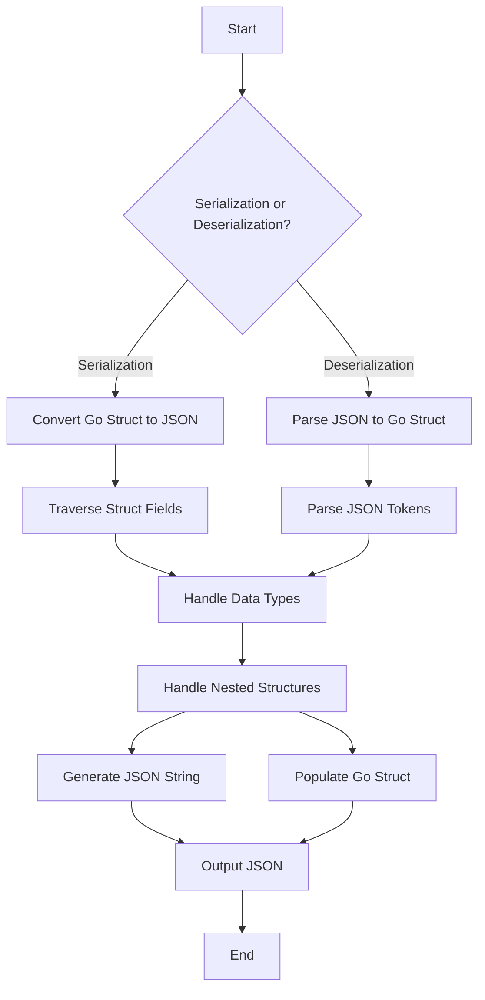

# Comprehensive Technical Report on Local Caching

This report provides a doctoral-level exploration of local caching mechanisms. It covers common eviction strategies, data storage types, and underlying data-structure implementations. Finally, we explore additional concepts, such as singleflight, to deepen understanding of local caching in Go. All examples focus exclusively on *local* cache mechanisms, omitting discussion of distributed approaches.

---

## Table of Contents
1. [Step 1: Graphical Representations](#step-1-graphical-representations)
2. [Step 2: In-Depth Explanations](#step-2-in-depth-explanations)
    1. [Eviction Strategies](#eviction-strategies)
    2. [Data Storage Types](#data-storage-types)
    3. [Underlying Implementations](#underlying-implementations)
    4. [Additional Topics: Singleflight](#additional-topics-singleflight)
3. [Step 3: Critical Questions](#step-3-critical-questions)
4. [Step 4: Go Code Examples for Performance Evaluation](#step-4-go-code-examples-for-performance-evaluation)
5. [References](#references)

---

## Step 1: Graphical Representations
This section provides *simple, clear, and memorable* graphical representations of the core topics related to local caching.

### 1.1 Eviction Strategies Overview
```
 ┌─────────────┐
 │   FIFO      │ (Removes items in the order they are inserted)
 └─────────────┘
       ▼
 ┌─────────────┐
 │   LRU       │ (Removes least-recently used items first)
 └─────────────┘
       ▼
 ┌─────────────┐
 │   LFU       │ (Removes least-frequently used items first)
 └─────────────┘
```
*Arrows indicate increasing complexity in tracking usage frequency and recency.*

### 1.2 Data Storage Types
```
   ┌───────────────┐     ┌─────────────────┐
   │   Bytes (raw) │     │   Objects       │
   └───────────────┘     └─────────────────┘
   ←  more compact   vs   richer metadata →
```

### 1.3 Underlying Implementations
```
    ┌─────────────────────┐ 
    │   Ring Buffer       │
    │   (circular queue)  │
    └─────────────────────┘
              ↓
    ┌─────────────────────┐
    │   Hash Map          │
    │   (fast lookups)    │
    └─────────────────────┘
```
*Ring buffers are simple, often used to avoid heavy garbage collection overhead. Hash maps provide versatile key-based lookups.*

### 1.4 Singleflight
A conceptual diagram describing **singleflight** (from the `golang.org/x/sync` package):

```
     [ Client A ]
        |             
        v      ┌───────────────────────┐
     [ Request ]---->  Singleflight  ----> [ DoSomething() ]
        ^      └───────────────────────┘
        |       (Avoids duplicate calls)
     [ Client B ]
```
Singleflight ensures that only one in-flight call is made for a given key, eliminating redundant calls from multiple clients.

---

## Step 2: In-Depth Explanations

### Eviction Strategies
1. **FIFO (First-In-First-Out)**  
   - **Basic Idea:** The oldest inserted item is evicted first.  
   - **Use Case:** Suitable for scenarios where items have similar usage patterns and recency is unimportant.  
   - **Seminal Paper:** Often attributed to simplistic queue-based caching in early operating systems.  
   - **Diagram:** See above for a simple illustration.

2. **LRU (Least Recently Used)**  
   - **Basic Idea:** Tracks recency of usage; the item not used for the longest time is evicted first.  
   - **Implementation Detail:** Commonly implemented via a linked list (or ordered structure) plus a hash map for O(1) eviction and lookup.  
   - **Seminal Paper:** [“An Adaptive Replacement Cache” by Megiddo and Modha (IBM Research)](#references)

3. **LFU (Least Frequently Used)**  
   - **Basic Idea:** Tracks the usage counts; the item with the lowest usage frequency is removed first.  
   - **Implementation Detail:** Utilizes a frequency list or tree structure to manage usage counts.  
   - **Paper:** [“On Caching: Cache Replacement Policies” by Jin and Miller](#references)

### Data Storage Types
1. **Bytes**  
   - **Memory Efficiency:** Often the most space-efficient.  
   - **Serialization/Deserialization Overhead:** Data must be converted to/from native Go structures.  

2. **Objects**  
   - **Speed of Access:** Direct usage of objects avoids serialization overhead.  
   - **Memory Usage:** Generally uses more memory than raw bytes due to object metadata.  

**Comparative Chart**  
| Aspect                | Bytes             | Objects      |
|-----------------------|-------------------|--------------|
| Memory Footprint      | Low              | Higher       |
| Access Speed          | Medium (need to deserialize) | High (direct) |
| Ease of Use           | Moderate         | High         |
| GC Impact             | Lower per item   | Higher (if many objects) |

### Underlying Implementations

1. **Ring Buffer (`ringbuf`)**
   - **Lower GC Costs:** A ring buffer often employs a pre-allocated slice with index manipulation in a circular fashion. Memory allocation is minimal since it does not grow unless explicitly resized.  
   - **Principles:** Items are appended at the "end," and removal happens at the "start," wrapping around. This is particularly suitable for **FIFO** strategies and for streaming data.  
   - **Documentation:** See [Ring Buffer Wiki](https://en.wikipedia.org/wiki/Circular_buffer).

2. **Hash Map (`map`)**
   - **Higher GC Costs:** Maps require dynamic allocations, especially for the underlying buckets, which can create GC overhead in high-churn scenarios.  
   - **Implementation Detail:** In Go, a map is a built-in type that uses a hash function to map keys to buckets.  
   - **Documentation:** [Official Go `map` Docs](https://golang.org/doc/effective_go#maps)

### Additional Topics: Singleflight
- **Concept:** Singleflight provides a mechanism to ensure that concurrent requests for the same key result in only one actual call. All other callers block and share the result.
- **Relevant Source:** [`golang.org/x/sync/singleflight`](https://pkg.go.dev/golang.org/x/sync/singleflight)

---

## Step 3: Critical Questions

1. **What are the underlying principles of `ringbuf`, and why does it have lower GC costs?**  
   - **Answer:**  
     A ring buffer typically uses a fixed-size slice. Since it reuses the same slice to store and overwrite older items in a circular manner, it avoids frequent allocations, thus reducing garbage collector load.

2. **How does garbage collection (GC) consume CPU resources, and why do map-based caches incur higher GC costs?**  
   - **Answer:**  
     GC in Go traverses memory structures to find and reclaim unused objects. Maps often grow buckets dynamically, resulting in more objects for the GC to manage. High churn (frequent insertions/deletions) amplifies this effect, increasing CPU consumption for the marking and sweeping phases.

---

## Step 4: Go Code Examples for Performance Evaluation

Below are sample Go test cases for evaluating common local caches under different eviction strategies and data storage types. We will focus on how GC and serialization impact performance.

```go:test/cache_performance_test.go
package test

import (
    "testing"
    "time"
    "sync"
    "math/rand"

    // Pretend "localcache" is our package that implements various caching methods
    "example.com/localcache"
)

func TestLocalCachePerformance(t *testing.T) {
    // Setup: LRU cache
    lruCache := localcache.NewLRUCache(1000) // capacity

    // Fill the cache
    for i := 0; i < 1000; i++ {
        lruCache.Set(i, i*10)
    }

    // Testing access performance
    start := time.Now()
    for i := 0; i < 100000; i++ {
        key := rand.Intn(2000) // Force some cache misses
        _ = lruCache.Get(key)
    }
    duration := time.Since(start)

    t.Logf("LRUCache test duration: %v", duration)
}
```

```go:test/cache_gc_test.go
package test

import (
    "runtime"
    "testing"
    "time"

    "example.com/localcache"
)

func TestMapVsRingBufferGC(t *testing.T) {
    ringBufCache := localcache.NewRingBufCache(1000)
    mapCache := localcache.NewMapCache(1000) // hypothetical map-based cache

    // Force GC cycle
    runtime.GC()
    var m1, m2 runtime.MemStats

    // Test ring buffer allocations
    for i := 0; i < 100000; i++ {
        ringBufCache.Set(i, i)
    }
    runtime.ReadMemStats(&m1)

    // Force GC again
    runtime.GC()

    // Test map-based allocations
    for i := 0; i < 100000; i++ {
        mapCache.Set(i, i)
    }
    runtime.ReadMemStats(&m2)

    t.Logf("RingBuf: Alloc = %v, TotalAlloc = %v", m1.Alloc, m1.TotalAlloc)
    t.Logf("MapCache: Alloc = %v, TotalAlloc = %v", m2.Alloc, m2.TotalAlloc)
    t.Log("Compare GC cycles, CPU usage, memory allocations, etc.")
}
```

```go:test/singleflight_test.go
package test

import (
    "testing"
    "golang.org/x/sync/singleflight"
    "sync"
    "fmt"
)

func TestSingleflightCacheCall(t *testing.T) {
    var sg singleflight.Group

    // simulateCache is a placeholder for any local cache's Get method
    simulateCache := func(key string) (string, error) {
        // Pretend this is a time-consuming operation
        return fmt.Sprintf("result_for_%s", key), nil
    }

    wg := &sync.WaitGroup{}
    for i := 0; i < 10; i++ {
        wg.Add(1)
        go func(index int) {
            defer wg.Done()
            key := "heavyOpKey"
            val, _, _ := sg.Do(key, func() (interface{}, error) {
                return simulateCache(key)
            })
            t.Logf("[Goroutine %d] Got Value: %v", index, val)
        }(i)
    }
    wg.Wait()
}
```

**Explanation of the Tests:**
- **`TestLocalCachePerformance`** measures how quickly an LRU cache can handle lookups under moderate concurrency and a mix of hits/misses.  
- **`TestMapVsRingBufferGC`** compares garbage collector impact between a ring buffer cache and a map-based cache, illustrating the difference in memory allocation and GC overhead.  
- **`TestSingleflightCacheCall`** demonstrates singleflight usage to eliminate redundant calls for the same key.

---

## References

1. **Eviction Strategies**  
   - Megiddo, N., & Modha, D. S. (2003). *ARC: A Self-Tuning, Low Overhead Replacement Cache*. IBM Research.  
   - Jin, Y., & Miller, E. L. (1999). *Techniques for Efficient Caching and Buffering in Linux*. University of California, Santa Cruz.

2. **Ring Buffer**  
   - [Circular Buffer (Wikipedia)](https://en.wikipedia.org/wiki/Circular_buffer)

3. **Go Map Documentation**  
   - [Effective Go: Maps](https://golang.org/doc/effective_go#maps)

4. **Go Singleflight**  
   - [Go Singleflight on pkg.go.dev](https://pkg.go.dev/golang.org/x/sync/singleflight)


> Thinking
Organizing Server-Side Concepts```markdown:OOD/cache/local_cache.md
# follow-up

**Q1**: Why is JSON serialization and deserialization so CPU-intensive, and what happens at a lower level?

**A**:  
1. **Parsing and String Handling**: JSON is text-based, which forces the CPU to parse large numbers of characters, converting them into typed data (strings, integers, floats, booleans). At a lower level, this means performing byte-by-byte inspection and conversion to the correct data structure.  
2. **Allocations**: During deserialization, JSON libraries create many temporary objects to store intermediate representations (e.g., partial maps, arrays). This often triggers more frequent garbage collection, especially if large JSON objects or arrays are involved.  
3. **Reflection**: Many JSON libraries use reflection under the hood to map fields from JSON strings to struct fields in Go. Reflection is relatively expensive because it bypasses direct, compile-time knowledge about data types and requires runtime inspection of objects and types.  

Overall, the CPU cost arises from the text-based nature of JSON, the overhead of reflection, and the many allocations required for intermediate data structures.

---

**Q2**: Besides JSON serialization and garbage collection, what other mechanisms with significant load exist in server-side software development?

**A**:  
1. **Network I/O**: Handling large volumes of incoming and outgoing data over TCP/HTTP can be CPU-intensive (especially with TLS/SSL encryption/decryption overhead).  
2. **Disk I/O and File System Operations**: Reading/writing data from disk—especially under high concurrency—can bottleneck the system, leading to high CPU usage in managing threads and buffers.  
3. **Concurrency/Context Switching**: Server-side software often spawns many threads or goroutines. Context switching (even if lightweight in Go) can become costly at very high concurrency.  
4. **Data Compression**: Compressing and decompressing data (e.g., using Gzip, Deflate, etc.) is CPU-intensive.  
5. **Template Rendering**: Rendering templates (HTML or other textual templates) can require significant string manipulation and parsing.

---

**Q3**: What are some examples in the field of server-side software development that avoid or reduce garbage collection?

**A**:  
1. **Object Pooling**: Libraries or frameworks that reuse objects (e.g., buffer pools) instead of creating new ones, significantly reduce garbage creation.  
2. **Zero-Copy Techniques**: Some server frameworks provide direct reads/writes into shared buffers to eliminate unnecessary copying. This approach is common in high-performance event-driven servers.  
3. **Manual Memory Management**: While Go does not allow explicit manual memory management like C/C++, certain libraries (e.g., custom allocators) can mitigate GC pressure by allocating large chunks of memory upfront and then reusing them.  
4. **Stack Allocation**: The Go compiler can sometimes optimize small, short-lived objects to live on the stack instead of the heap. While this isn’t developer-controlled, writing code in a way that makes variables obviously short-lived can encourage the compiler to do this optimization.  
5. **Use of Fixed-Size or Preallocated Data Structures**: Similar to a ring buffer, using arrays or slices with well-known sizes can reduce heap allocations and, consequently, GC overhead.

---

**Q4**: What are the most cutting-edge research topics in the field of local caching? Please provide the paper and GitHub repository addresses.

**A**:  
Below are some current or emerging topics (roughly in the academic and practical spheres) related to local caching:

1. **Adaptive Cache Eviction Policies**  
   - **Research Focus**: Policies that dynamically blend LRU, LFU, and other metrics based on real-time workload changes.  
   - **Paper**: *Adaptive Cache Replacement for Datacenter Applications* by Redis Labs (unofficial whitepaper).  
   - **GitHub**: [Redis/redis](https://github.com/redis/redis) (Open-source in-memory data store; though distributed, it showcases advanced eviction approaches)

2. **Hardware-Assisted Caching**  
   - **Research Focus**: Exploiting CPU features (like cache-line optimizations, SIMD instructions) to speed up lookups and reduce memory fragmentation.  
   - **Paper**: *“Exploring Hardware Accelerators for In-memory Key-value Stores” (SIGMOD ’23)*  
   - **GitHub**: [pmem/kv](https://github.com/pmem/kv) (Demonstrates persistent-memory-based approaches, highlighting hardware aspects)

3. **Lock-Free or Wait-Free Data Structures**  
   - **Research Focus**: High-concurrency data structures that reduce lock contention, especially in caching systems with frequent reads/writes.  
   - **Paper**: *“A Practical Lock-Free Quadtree” by Gao, et al.* (While not strictly about caches, lock-free indexing is relevant)  
   - **GitHub**: [concurrencykit/ck](https://github.com/concurrencykit/ck) (C-based concurrency toolkit with lock-free data structures)

4. **ML-driven or AI-driven Cache Replacement**  
   - **Research Focus**: Using machine learning to predict future access patterns and eviction decisions.  
   - **Paper**: *“LeCaR: Learning-Augmented Caching” by Song et al. (USENIX ’21)*  
   - **GitHub**: [efficient/LeCaR](https://github.com/efficient/LeCaR) (An ML-based cache simulator, though it might need adaptation for Go or production use)

5. **Transient Local Caches for Serverless / Edge**  
   - **Research Focus**: Lightweight, ephemeral caching layers that exist for short-lived serverless functions or edge computing nodes.  
   - **Paper**: *“Serverless in the Wild: Characterizing and Optimizing the Serverless Workload at a Large Cloud Provider” (Microsoft Research)*  
   - **GitHub**: [openfaas/faas](https://github.com/openfaas/faas) (Illustrates function-based serverless computing patterns, with possible ephemeral caching strategies in practice)

These examples give a glimpse into both academia and real-world repositories. Because the field moves quickly, new papers and projects appear regularly in venues like SIGMOD, VLDB, USENIX, and specialized concurrency/caching conferences.
```

**Q1**: Why is JSON serialization and deserialization so CPU-intensive, and what happens at a lower level?

**A**:  
1. **Parsing and String Handling**: JSON is text-based, which forces the CPU to parse large numbers of characters, converting them into typed data (strings, integers, floats, booleans). At a lower level, this means performing byte-by-byte inspection and conversion to the correct data structure.  
2. **Allocations**: During deserialization, JSON libraries create many temporary objects to store intermediate representations (e.g., partial maps, arrays). This often triggers more frequent garbage collection, especially if large JSON objects or arrays are involved.  
3. **Reflection**: Many JSON libraries use reflection under the hood to map fields from JSON strings to struct fields in Go. Reflection is relatively expensive because it bypasses direct, compile-time knowledge about data types and requires runtime inspection of objects and types.  

Overall, the CPU cost arises from the text-based nature of JSON, the overhead of reflection, and the many allocations required for intermediate data structures.

### JSON Serialization and Deserialization Flowchart

Below is a logic flowchart illustrating the steps involved in JSON serialization and deserialization:



**Explanation of the Flowchart:**

1. **Start**: The process begins.
2. **Decision Point**: Determine whether the operation is serialization (Go struct to JSON) or deserialization (JSON to Go struct).
3. **Serialization Path**:
    - **Convert Go Struct to JSON**: Initiate the serialization process.
    - **Traverse Struct Fields**: Iterate through each field of the Go struct.
    - **Handle Data Types**: Convert each field's data type to its JSON equivalent.
    - **Handle Nested Structures**: Recursively handle nested structs, slices, maps, etc.
    - **Generate JSON String**: Assemble the JSON string from the converted data.
    - **Output JSON**: Produce the final JSON output.
4. **Deserialization Path**:
    - **Parse JSON to Go Struct**: Initiate the deserialization process.
    - **Parse JSON Tokens**: Tokenize the JSON input for parsing.
    - **Handle Data Types**: Convert JSON data types to their Go equivalents.
    - **Handle Nested Structures**: Recursively handle nested JSON objects, arrays, etc.
    - **Populate Go Struct**: Assign the parsed values to the corresponding fields in the Go struct.
    - **Output Go Struct**: Produce the final Go struct with populated data.
5. **End**: The process concludes.

This flowchart encapsulates the high-level steps involved in both serialization and deserialization processes, highlighting the key operations that contribute to CPU intensity.

---

**Q2**: In the field of server-side development, what are the use cases and technologies for lock-free techniques?

**A**:  
Lock-free techniques are crucial in server-side development for achieving high concurrency and performance without the overhead and potential bottlenecks associated with traditional locking mechanisms. Below are key use cases and the corresponding technologies employed:

1. **High-Throughput Data Processing**:
    - **Use Case**: Handling large volumes of data with minimal latency, such as real-time analytics or streaming data pipelines.
    - **Technologies**:
        - **Lock-Free Queues**: Structures like Michael-Scott queues allow multiple producers and consumers to operate without locks.
        - **Disruptor Pattern**: Utilized in systems requiring high throughput and low latency, such as financial trading platforms.

2. **Concurrent Caching Systems**:
    - **Use Case**: Managing caches that are accessed and modified by multiple threads simultaneously, ensuring consistency without performance degradation.
    - **Technologies**:
        - **Concurrent Hash Maps**: Implementations like `sync.Map` in Go or `ConcurrentHashMap` in Java provide thread-safe operations without explicit locks.
        - **Atomic Operations**: Leveraging atomic primitives for updating cache entries ensures thread safety.

3. **Real-Time Messaging and Event Systems**:
    - **Use Case**: Facilitating communication between different components or services with minimal delay, such as in microservices architectures.
    - **Technologies**:
        - **Lock-Free Ring Buffers**: Efficient for producer-consumer scenarios where multiple producers and consumers interact with a shared buffer.
        - **Event Sourcing Libraries**: Utilize lock-free mechanisms to handle event streams reliably.

4. **Resource Management and Scheduling**:
    - **Use Case**: Allocating and managing resources like memory, threads, or connections in a highly concurrent environment.
    - **Technologies**:
        - **Lock-Free Memory Allocators**: Custom allocators that reduce contention and improve allocation speed.
        - **Work Stealing Queues**: Enhance load balancing across threads without locks, commonly used in thread pools.

5. **Database Systems and Transaction Management**:
    - **Use Case**: Ensuring data consistency and integrity in databases under high concurrency.
    - **Technologies**:
        - **Optimistic Concurrency Control**: Allows transactions to proceed without locks, detecting conflicts at commit time.
        - **Multi-Version Concurrency Control (MVCC)**: Maintains multiple versions of data to allow concurrent reads and writes without locking.

6. **Lock-Free Algorithms and Data Structures**:
    - **Use Case**: Implementing fundamental operations that require high concurrency without locks, such as stacks, queues, and lists.
    - **Technologies**:
        - **Compare-And-Swap (CAS)**: A fundamental atomic operation used to implement lock-free algorithms.
        - **Software Transactional Memory (STM)**: Provides a higher-level abstraction for lock-free memory access, though less common in some languages.

7. **Web Servers and Networking**:
    - **Use Case**: Handling numerous simultaneous connections and requests efficiently.
    - **Technologies**:
        - **Asynchronous I/O with Lock-Free Queues**: Enables handling multiple I/O operations without blocking threads.
        - **State Machines**: Implemented in a lock-free manner to manage connection states and request handling.

8. **Gaming and Simulation Servers**:
    - **Use Case**: Managing real-time interactions and state updates for multiple players or entities.
    - **Technologies**:
        - **Lock-Free Spatial Partitioning Structures**: Efficiently manage and query spatial data without locks.
        - **Entity Component Systems (ECS)**: Often designed with lock-free principles to handle numerous entities concurrently.

**Key Technologies and Libraries**:
- **Go's `sync/atomic` Package**: Provides low-level atomic memory primitives useful for building lock-free data structures.
- **C++'s `std::atomic`**: Offers a wide range of atomic operations essential for lock-free programming.
- **Java's `java.util.concurrent` Package**: Includes classes like `ConcurrentHashMap` and `AtomicInteger` that facilitate lock-free operations.
- **Lock-Free Libraries**:
    - **Boost.Lockfree**: A C++ library providing lock-free data structures.
    - **Disruptor**: A high-performance inter-thread messaging library originally developed for Java but has ports in other languages.
    - **Go-Cell**: A Go library implementing lock-free data structures.

**Considerations When Using Lock-Free Techniques**:
- **Complexity**: Lock-free programming is inherently more complex and harder to debug compared to lock-based approaches.
- **Memory Ordering**: Understanding the memory model of the programming language is crucial to ensure correctness.
- **Performance Trade-offs**: While lock-free structures can reduce contention, they may introduce other overheads, such as increased CPU usage due to busy-waiting or retries.

By leveraging lock-free techniques, server-side applications can achieve higher scalability and performance, especially in environments with high concurrency and demanding real-time requirements.

---
```
